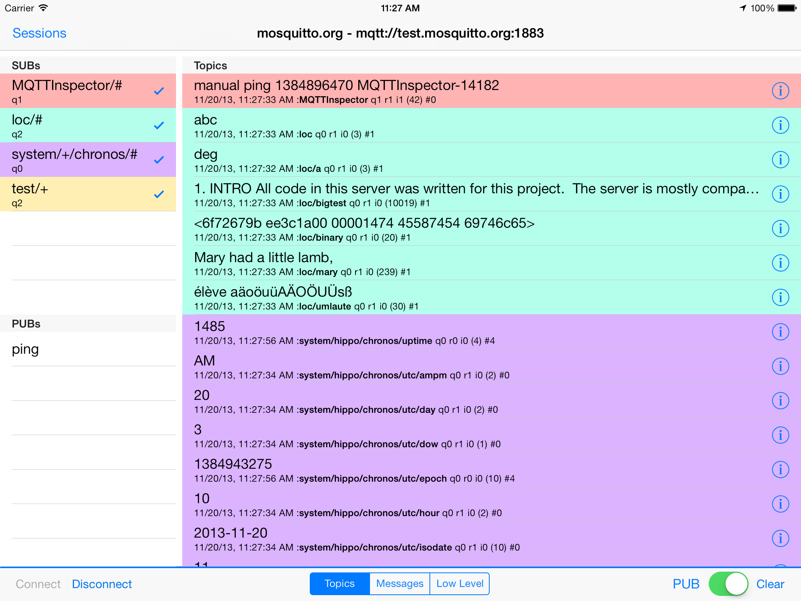
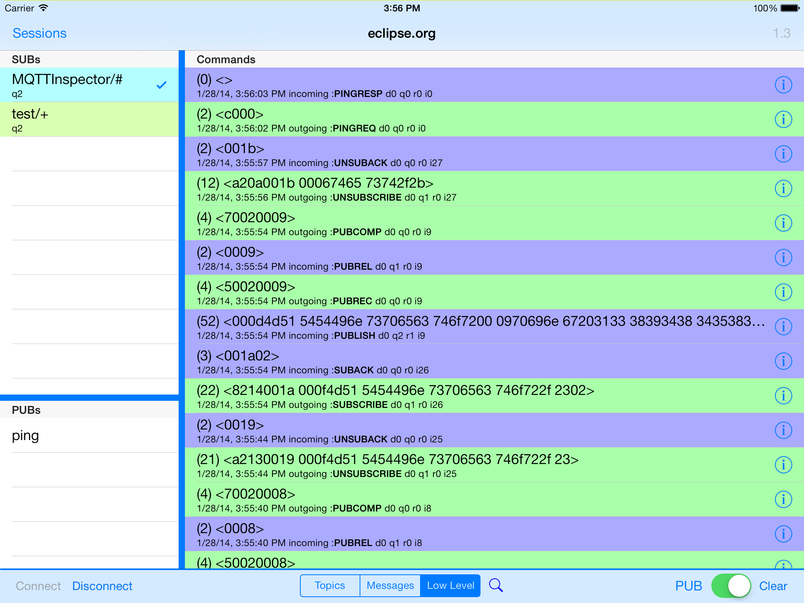
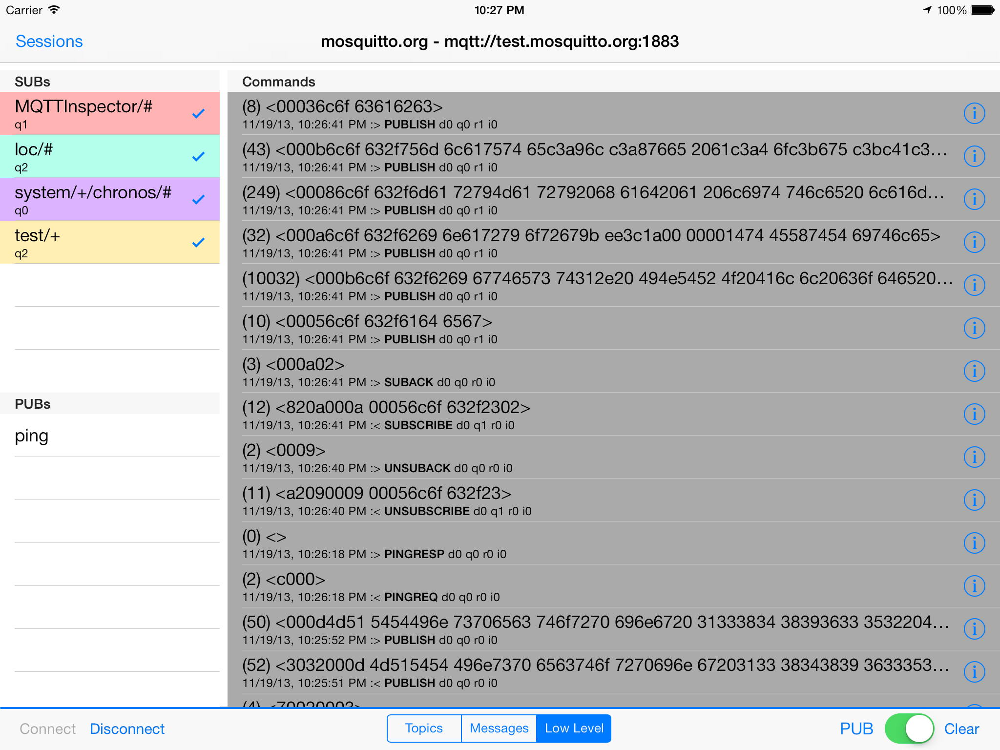
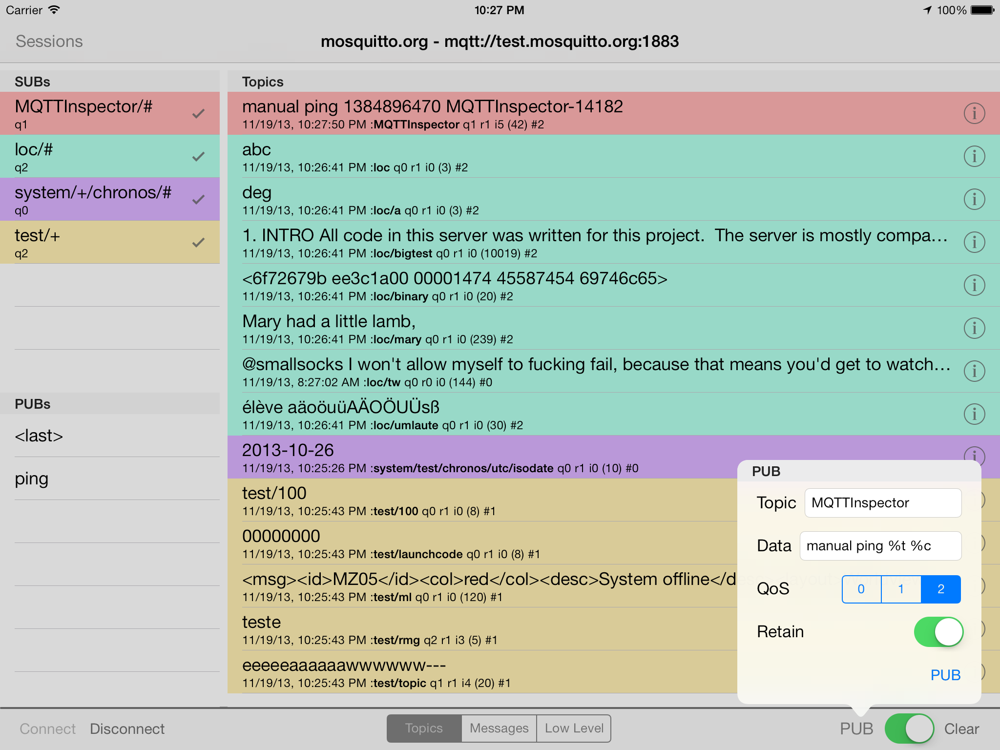
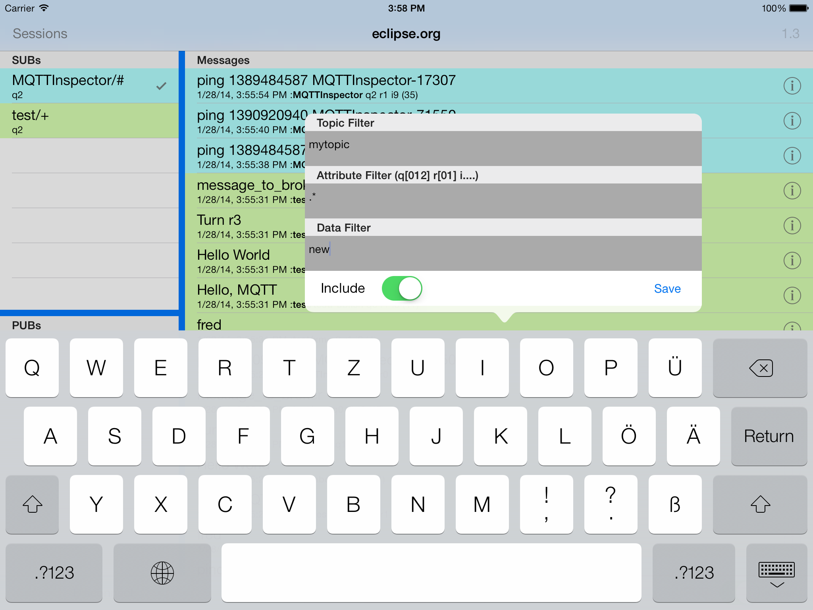
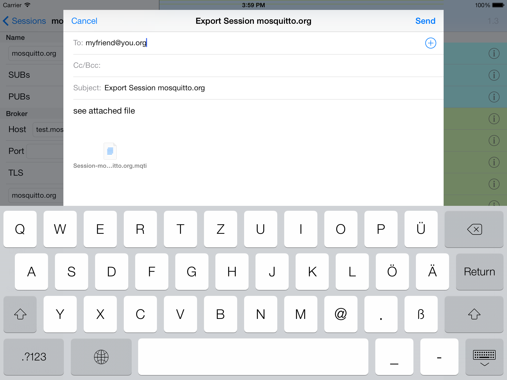
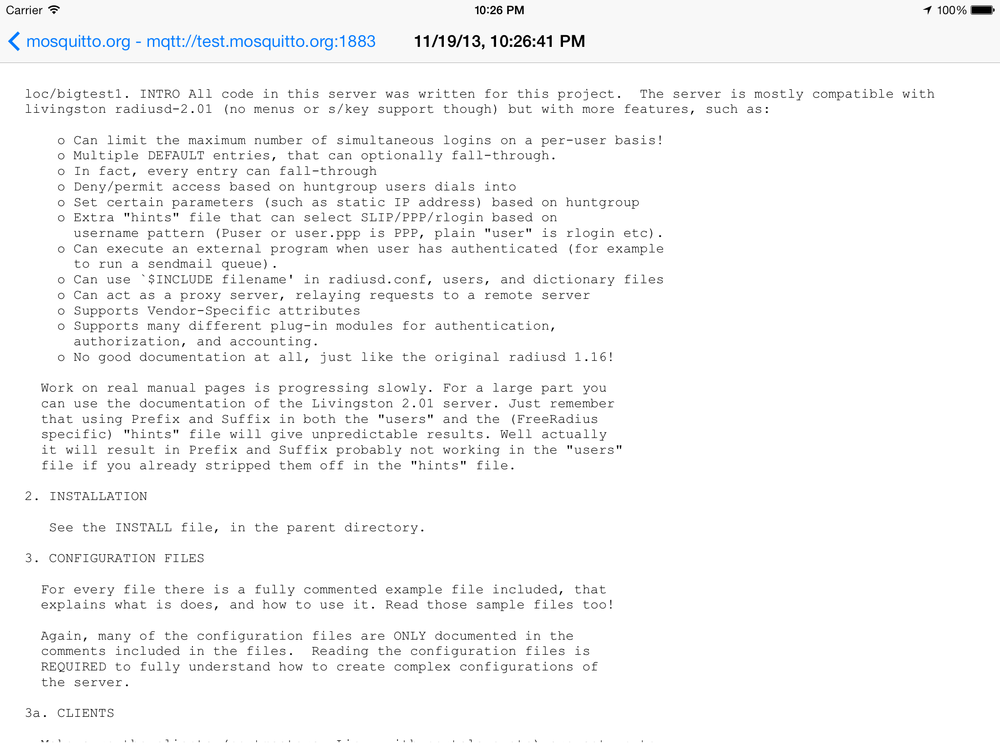

MQTTInspector
=============

A general MQTT testing app for iOS (iPhone and iPad)

# Features 
* Multiple sessions
* Pre-configured Subscriptions and Publications (stored for later use)
* Ad-hoc PUB
* PUB payload can contain `%t` and `%c`, replaced by timestamp and clientID respectively
* Support for viewing UTF-8 printable payloads as well as very long payloads
* Supports hex-dump of payloads when not printable
* Panel scrolling incoming sub's, latest on top, color-coded topics according to SUBs
* Panel toggable to 'Topic'-mode. In this, incoming msgs do NOT scroll. Instead, last msg overwrites prev on a per/topic basis. Think: temp/outdoors and webserv/status where I see last value without panel scrolling moving: just values on topics change.
* Panel showing low-level communication with broker
* Panels can be frozen (halts all display activity) for, say, taking screenshots

# New features in 1.71
* [FIX] crash on disconnect closes #63

# New features in 1.7
* [NEW] show version number in lauch screen
* [NEW] Fabric.io Crashlytics included
* [NEW] Cocoalumberjack Pod included
* [NEW] SB4Json as Pod
* [FIX] crash when trying to display connect error
* [FIX] crash when receiving binary payload closes #62
* [NEW] return key in text fields closes keyboard

# New features in 1.3
* Drag to adjust screen sizes
* Export (share) edit, and import your complete session settings via email / json
* Filter incoming messages using regular expressions on topics, data and attributes

# Testimonials

* “@Sine_Wave_Tech: #MQTT going mainstream, hit the #Apple #appstore - great advance for #IoT https://t.co/3oXRJDsXYp”
* “@voluntas: MQTTInspector 買ってみた。 http://t.co/0Wxbb0OTmG” (http://translate.google.de/#auto/en/買ってみた。
* “@dobermai: Don’t know what I would have done without the MQTTInspector App by @ChristophKrey today. Mandatory #mqtt app for every iOS device!”
* “@OwnTracks: Looking for a versatile MQTT debugging app? Check out MQTT Inspector for iOS by @ChristophKrey http://t.co/pTAR928DrW I'm loving it! [JP]”
* “@jpmens: If you want to see a demo of what MQTT Inspector for iOS will look like, @ChristophKrey has a video here http://t.co/JhiRJL5soy”
* “@jpmens: MQTT Inspector for iOS with app-side filtering & settings import/export https://t.co/Re2yQPYsUC (info: http://t.co/z26ATPPIX4)”

# Future enhancements
* View traps
* automatically repeating PUBs

# Screenshots

